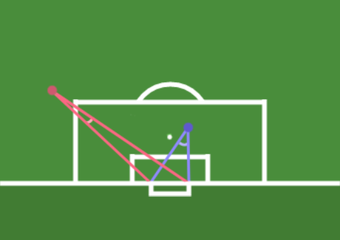
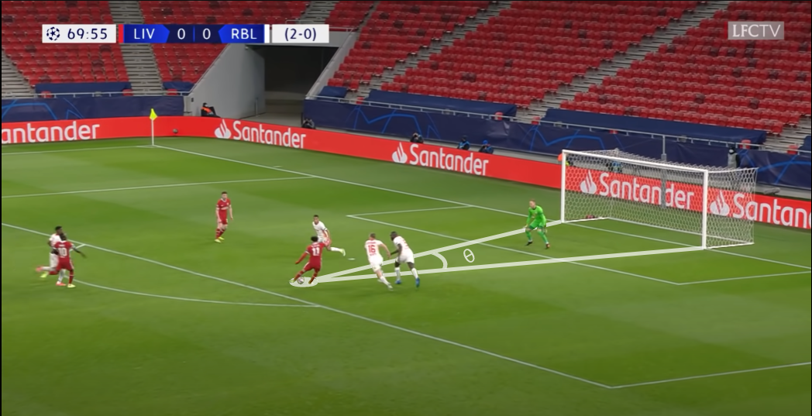

# Open XG

A open source project to develop live xG prediction models 
from photo and video input using Computer Vision. 

### Preprocessing

A component of any xG model is a player's position relative to the goal, intuitively we understand some positions are more difficult than others. I.e. A headon shot 10 yards out is easier than a shot 5 yards out but hugging the touchline. A easy way to quantify these positions is to derive a theta using the player's position and either goal posts. This theta can be used as a representation of an angle to goal. Simply, the larger the theta the better the chance. In order to derive a theta we must preprocess our images such that there is a sense of uniformity. We then can input keypoints to a standarized function and have that function return a theta.

<table><tr>
<td>  
        
 
                
 2D Representation 
 
        

</td>
<td> 
        
 
                
 Real World Example 
 
        

</td>
</tr></table>

## Authors

- [@jro17002](https://www.github.com/jro17002)

## Acknowledgements

 - [What are expected goals (xG)? ](https://theanalyst.com/na/2021/07/what-are-expected-goals-xg/)
 - [How to Build An Expected Goals Model](https://www.youtube.com/watch?v=bpjLyFyLlXs&t=1201s)

